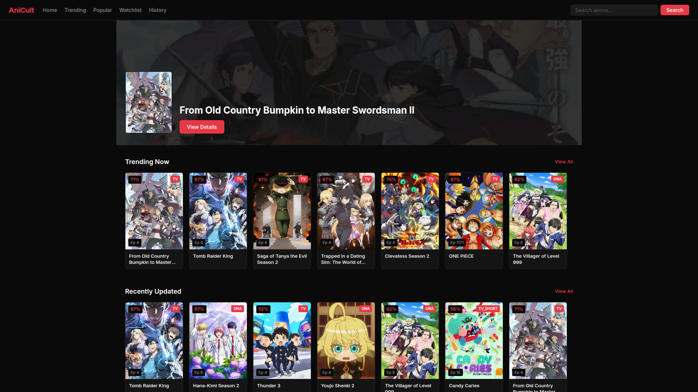

<h1 align="center">AniCult</h1>

<p align="center">
  A clean anime streaming experience — browse via AniList, watch via direct embed players.
</p>

<p align="center">
  <a href="https://anicult.vercel.app/"></a>
  <a href="https://github.com/aluukill/AniCult"></a>
</p>

<p align="center">
  
</p>

---

## About

AniCult is a fully client-side single-page application. No server, no build step, no runtime dependencies. Open `index.html` and it works.

- **Anime browsing** uses the AniList GraphQL API (CORS-enabled)
- **Video playback** uses Megavid embed player (AniList ID based, no scraping)

## Features

- **Anime Discovery** — Trending, popular, and recently updated anime from AniList
- **Search & Filters** — Full-text search with sort and format filters
- **Anime Details** — Synopsis, genres, episode grid, related anime
- **Embed Streaming** — Instant video playback via Megavid embed (sub/dub)
- **Watchlist & History** — LocalStorage persistence with episode progress tracking
- **Infinite Scroll** — Intersection Observer for lazy-loading
- **Dark UI** — Inter font, responsive, minimal

## Live Demo

**[anicult.vercel.app](https://anicult.vercel.app/)** — hosted on Vercel, no install required.

## Getting Started

```
open index.html
```

Or deploy your own: fork the repo and connect to Vercel — zero config.

## Files

| File           | What it does                                                   |
| -------------- | -------------------------------------------------------------- |
| `index.html`   | Nav, search bar, main container, SEO meta tags                 |
| `styles.css`   | All styles — dark theme, responsive, components                |
| `app.js`       | SPA router, AniList API, embed player, rendering, localStorage |
| `favicon.svg`  | SVG favicon                                                    |
| `vercel.json`  | Vercel deployment config                                       |
| `robots.txt`   | Crawler instructions for search engines                        |
| `sitemap.xml`  | XML sitemap for SEO                                            |

## How It Works

1. Browse anime on the home page (trending, popular, recent)
2. Click into a detail page, pick an episode
3. Megavid embed loads instantly using the AniList ID
4. Video plays in an iframe with subtitle support
5. History and progress save to localStorage

## License

[MIT](LICENSE)
